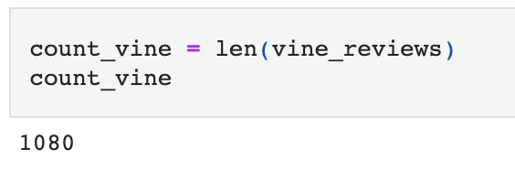
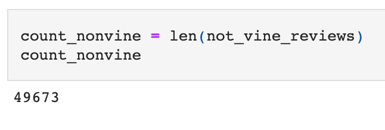
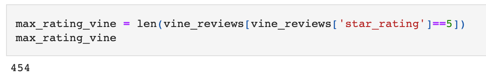
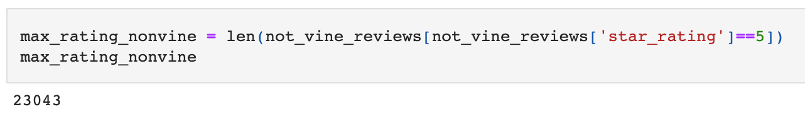
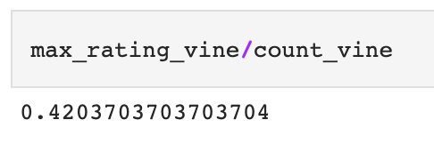

# Amazon_Vine_Analysis

*Analysis with Pyspak and AWS*

Note: Password from Amazon_Reviews_ETL.ipynb file is deleted for safety reason. File needs pgAdmin password in order to run. 

## Project Overview
For this project I am using Amazon’s cloud service AWS, Google Colab and Pyspark to analyze Amazon’s reviews for outdoor products. The purpose of this analysis is to determine if there is any bias toward favorable reviews from Vine members. Amazon Vine program is a service that allows manufacturers to have reviews posted on Amazon for their pre-release items, for an additional fee.  

## Results
In this analysis I analyzed reviews that have more than 20 total votes and the percentage of helpful votes is equal or greater than 50.

***How many Vine reviews and non-Vine reviews were there?***

There were
- **1,080 Vine** reviews and 
- **49,673 non-Vine** reviews.

(Figure 1) | (Figure 2)
:------------------------------------------:| :-------------------------------------:	
 | 

<i>Figure 1: Total Vine and non-Vine reviews.</i>

***How many Vine reviews were 5 stars? How many non-Vine reviews were 5 stars?***

There were
- **454** five stars **Vine** reviews and 
- **23,043**  five stars **non-Vine** reviews.

(Figure 1) | (Figure 2)
:------------------------------------------:| :-------------------------------------:	
 | 

<i>Figure 1: Total Vine and non-Vine reviews.</i>

***What percentage of Vine reviews were 5 stars? What percentage of non-Vine reviews were 5 stars?***

- **42.0 %** of **Vine** reviews were 5 stars and 
- **46.4 %** of **non-Vine** reviews were 5 stars.

(Figure 1) | (Figure 2)
:------------------------------------------:| :-------------------------------------:	
 | 

<i>Figure 1: Total Vine and non-Vine reviews.</i>

## Summary

The purpose of this analysis is to analyze and determine if any bias toward favorable reviews from Vine members in the dataset exists. Reviews that obtained more than 20 total votes and the percentage of helpful votes which is equal or greater than 50 were used. This selection was made in order to pick reviews that are more likely to be helpful.

**Positivity bias for reviews in the Vine program**

In the analysis I analyze 5-star reviews within conditions mentioned above. Calculations show that there is **no positivity bias for reviews in the Vine program**. The results show that percentage of 5 stars Vine reviews is 42.0% and percentage of 5 stars non-Vine reviews is 46.4%. **Non-Vine reviews** have slightly **higher percentage** of the 5 stars reviews, **4.4% percentage points** to be exact.
