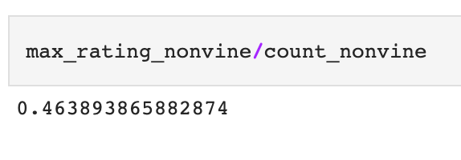

# Amazon_Vine_Analysis 

## Project Overview
This project utilizes Amazon’s cloud service AWS, Google Colab and Pyspark to analyze Amazon’s reviews for Electronic products. The purpose of this analysis is to determine if any bias toward favorable reviews from Vine members exists. Amazon Vine program is a service that allows manufacturers to have reviews posted on Amazon for their pre-release items, for an additional fee.  

## Results
In this analysis I analyzed reviews that have more than 20 total votes and the percentage of helpful votes is equal or greater than 50.

***How many Vine reviews and non-Vine reviews were there?***

There were
- **1,080 Vine** reviews and 
- **49,673 non-Vine** reviews.

(Figure 1) | (Figure 2)
:------------------------------------------:| :-------------------------------------:	
 | 

<i>Figure 1: Total Vine and non-Vine reviews.</i>

***How many Vine reviews were 5 stars? How many non-Vine reviews were 5 stars?***

There were
- **454** five stars **Vine** reviews and 
- **23,043**  five stars **non-Vine** reviews.

(Figure 1) | (Figure 2)
:------------------------------------------:| :-------------------------------------:	
 | 

<i>Figure 2: Number of 5-star Vine and non-Vine reviews.</i>

***What percentage of Vine reviews were 5 stars? What percentage of non-Vine reviews were 5 stars?***

- **42.0 %** of **Vine** reviews were 5 stars and 
- **46.4 %** of **non-Vine** reviews were 5 stars.

(Figure 1) | (Figure 2)
:------------------------------------------:| :-------------------------------------:	
 | 

<i>Figure 3: Percentage of Vine and non-vine reviews that were 5 stars.</i>

## Summary

The purpose of this analysis is to analyze and determine if any bias toward favorable reviews from Vine members in the dataset exists. Reviews that obtained more than 20 total votes and the percentage of helpful votes which is equal or greater than 50 were used. This selection was made in order to pick reviews that are more likely to be helpful.

**Positivity bias for reviews in the Vine program**

In the analysis I analyze 5-star reviews within conditions mentioned above. Calculations show that there is **no positivity bias for reviews in the Vine program**. The results show that percentage of 5 stars Vine reviews is 42.0% and percentage of 5 stars non-Vine reviews is 46.4%. **Non-Vine reviews** have slightly **higher percentage** of the 5 stars reviews, **4.4% percentage points** to be exact.

 :bangbang:*To be clear, there exists no evidence of bias of this data set of reviews relating to the electronics dept., an analysis done on a different set obtained from a different dept. may show different conclusions* :bangbang:
 
 **Additional analyses and suggestions**
 
- Addinitinal suggestion for furthter analysis could include as mentioned above running tthe exact same summary upon different datasets to see if the otcome is otherwise different and then make an aggregate decision from there.

- summarize not only 5 star reviews but also look into 1 thrrough 4 star reviews.,

- also look at the average rating that each program has acumulated as can be seen below (though a coution on this mehtod as sample sizes of each (vine and non-vine) data sets differ vastly): 

(Figure 1) | (Figure 2)
:------------------------------------------:| :-------------------------------------:	
 | 

<i>Figure 4: Average star rating of paid(vine) and unpaid(non-vine) programs.</i>

As we can see the vine program had a significantly higher average star rating than that of the non-vine (4.09 v 3.65), and so implimentatnion and use of the vine program may actually indeed result in an overall higher star rating for that vendor (on average).
